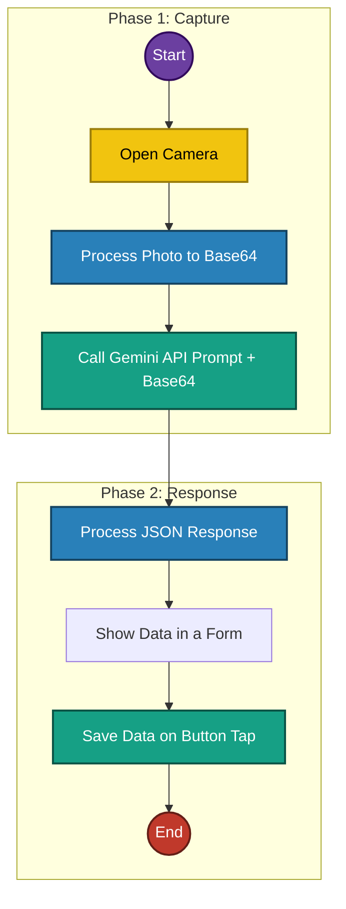

# RN-Health-Tracker-AI

<div align="center">

[](https://github.com/andresserranodev/RN-Health-Tracker-AI/actions/workflows/ci.yml)
[](https://www.codefactor.io/repository/github/andresserranodev/rn-health-tracker-ai)
[](https://codecov.io/gh/andresserranodev/RN-Health-Tracker-AI)
[](https://github.com/withastro/astro/blob/main/LICENSE)

</div>

# Presure Health Tracker

Welcome to the **Presure Health Tracker**! This project is designed to help you monitor and manage your health in a simple and organized way.

## 🚀 Access the Notion Board

All project management, tracking, and documentation are centralized on our Notion board. You can access it through the following link:

[**Access the Presure Health Tracker Notion Board**](https://www.notion.so/Presure-Health-Tracker-237b4495048780ab9ab9fcb54156b790?source=copy_link)

## 📋 Overview


## 🎯 Project Purpose

This application was developed with two primary goals in mind:

1.  **To learn and practice React Native:** It serves as a hands-on project to build skills in cross-platform mobile application development.
2.  **To test the Gemini API:** Specifically, this project explores the capabilities of the [**Gemini Image Understanding API**](https://ai.google.dev/gemini-api/docs/image-understanding). The goal is to experiment with integrating this AI model for innovative health-related features, such as analyzing images of meals or medical readings.

## ⚙️ App Workflow



## 🏗️ Project Architecture

This project follows **Clean Architecture** principles with clear separation of concerns across four main layers:

### 📂 Directory Structure

```
HealthTracker/src/
├── domain/                 # Business logic layer (framework-agnostic)
│   ├── entities/          # Domain models and value objects
│   ├── repositories/      # Repository interfaces (contracts)
│   └── use-cases/         # Business operations
├── infrastructure/        # Technical implementations
│   ├── api/              # External API integration (Gemini)
│   ├── di/               # Dependency injection container
│   ├── mappers/          # Data transformation
│   ├── repositories/     # Repository implementations
│   └── services/         # External services (Camera, Image)
├── presentation/         # UI and presentation logic
│   ├── components/       # Reusable UI components
│   ├── hooks/           # Custom React hooks
│   ├── navigation/      # App navigation
│   └── screens/         # Screen components
└── shared/              # Cross-cutting concerns
    ├── constants/       # App-wide constants
    └── templates/       # Shared templates (PDF)
```

### 🔄 Layer Dependencies

```
Presentation (UI + Hooks)
    ↓ uses
Domain (Entities + Use Cases + Interfaces)
    ↓ implements
Infrastructure (Repositories + API + Services)
    ↓ uses
Shared (Constants + Templates)
```

### 🎯 Key Design Patterns

- **Repository Pattern**: Abstracts data access through interfaces
- **Use Case Pattern**: Encapsulates business logic in single-responsibility functions
- **Dependency Injection**: Central DI container manages dependencies
- **Mapper Pattern**: Transforms data between architectural layers
- **Custom Hooks**: Separates UI logic from presentation components

### 📋 Key Files

**Domain Layer:**

- `domain/entities/BloodPressureReading.ts` - Core domain entity
- `domain/use-cases/saveBloodPressure.ts` - Save reading logic
- `domain/use-cases/extractReadingsFromImage.ts` - AI extraction logic

**Infrastructure Layer:**

- `infrastructure/di/Container.ts` - Dependency injection container
- `infrastructure/repositories/InMemoryBloodPressureRepository.ts` - Data storage
- `infrastructure/api/geminiService.ts` - Gemini AI integration

**Presentation Layer:**

- `presentation/hooks/useBloodPressureData.ts` - State management
- `presentation/hooks/useCameraHandler.ts` - Camera + AI workflow
- `presentation/screens/HomeScreen.tsx` - Main screen

## ✨ Key Features of the Board

- **Custom Views:** Different ways to view your data for clearer analysis.
- **Pre-defined Templates:** Easily create new health entries.
- **Integration and Flexibility:** Connect with other tools if needed and adapt the board to your specific needs.

## 🛠️ How to run it

### Prerequisites

- Node.js (LTS version)
- npm or yarn
- Expo Go app on your mobile device

### Installation & Setup

1.  **Clone the repository:**

2.  **Install dependencies:**

    ```bash
    npm install
    ```

3.  **Set up environment variables:**

    This project uses a `.env` file to manage environment variables like API keys. To get set up, copy the example file:

    ```bash
    cp .env.example .env
    ```

    Next, open the newly created `.env` file and add your personal Google Gemini API key in the as a EXPO_PUBLIC_GEMINI_API_KEY.

    Your `.env` file is already listed in `.gitignore` to ensure your keys are never committed to the repository.

4.  **Run the application:**
    ```bash
    npx expo start
    ```

---

## ESLint and Prettier Setup

### Overview

ESLint has been successfully integrated into the React Native Health Tracker project with comprehensive linting rules for TypeScript, React, and React Native development.

### Installed Dependencies

The following ESLint-related packages were installed as devDependencies:

- `eslint` - Core ESLint library
- `@typescript-eslint/parser` - TypeScript parser for ESLint
- `@typescript-eslint/eslint-plugin` - TypeScript-specific linting rules
- `eslint-plugin-react` - React-specific linting rules
- `eslint-plugin-react-hooks` - React Hooks linting rules
- `eslint-plugin-react-native` - React Native-specific linting rules
- `eslint-plugin-import` - Import/export syntax linting
- `eslint-plugin-jsx-a11y` - JSX accessibility linting
- `eslint-config-prettier` - Disables conflicting ESLint rules with Prettier
- `eslint-plugin-prettier` - Runs Prettier as an ESLint rule
- `prettier` - Code formatter

### Configuration Files

#### eslint.config.js

- Uses ESLint v9 flat configuration format
- Configured for TypeScript, React, and React Native
- Includes comprehensive rule sets for code quality and consistency

#### .prettierrc.js

- Prettier configuration for consistent code formatting
- Configured with single quotes, trailing commas, and other formatting preferences

### Available Scripts

The following scripts have been added to package.json:

```json
{
  "lint": "eslint . --ext .js,.jsx,.ts,.tsx",
  "lint:fix": "eslint . --ext .js,.jsx,.ts,.tsx --fix",
  "format": "prettier --write \"**/*.{js,jsx,ts,tsx,json,md}\"",
  "format:check": "prettier --check \"**/*.{js,jsx,ts,tsx,json,md}\""
}
```

### Usage

#### Linting

```bash
# Check for linting issues
npm run lint

# Auto-fix linting issues
npm run lint:fix
```

#### Formatting

```bash
# Format all files
npm run format

# Check if files are formatted correctly
npm run format:check
```

### Key Rules Enabled

#### TypeScript Rules

- No unused variables (with underscore prefix exception)
- No explicit `any` types (warning)
- Prefer const over let/var

#### React Rules

- React in JSX scope not required (React 17+)
- No prop-types (using TypeScript)
- Hooks rules enforcement

#### React Native Rules

- No unused styles
- No inline styles (warning)
- No color literals (warning)
- No raw text outside Text components

#### Import Rules

- Organized import order
- Alphabetical sorting within groups
- Newlines between import groups

#### Code Quality Rules

- No console statements (warning)
- No debugger statements
- Prefer template literals
- Object shorthand notation

### Current Status

✅ ESLint is successfully installed and configured
✅ Auto-fix resolved most formatting issues (500 → 95 problems)
✅ Remaining issues are mostly warnings about:

- Color literals in styles (React Native best practice warnings)
- Console statements (development warnings)
- Import resolver configuration (expected in React Native projects)

### Next Steps

1. **Gradual Cleanup**: Address remaining warnings over time
2. **IDE Integration**: Configure your IDE to show ESLint errors in real-time
3. **Pre-commit Hooks**: Consider adding ESLint checks to git pre-commit hooks
4. **Team Standards**: Review and adjust rules based on team preferences

### Troubleshooting

If you encounter issues:

1. **Import Resolver Errors**: These are common in React Native and can be safely ignored or configured with additional resolver settings
2. **Color Literal Warnings**: Consider extracting colors to a theme file for better maintainability
3. **Console Warnings**: Replace `console.log` with `console.warn`, `console.error`, or remove in production builds

The ESLint setup is now ready to help maintain code quality and consistency across your React Native Health Tracker project!

---

## Husky Pre-commit Hook Setup

### Overview

Husky is now configured to automatically run linting checks before every commit, ensuring code quality is maintained across the entire team.

### What's Configured

#### 1. Husky Installation

- **Package**: `husky` installed as dev dependency in [`HealthTracker/package.json`](HealthTracker/package.json)
- **Prepare Script**: `"prepare": "husky"` ensures Husky is set up when dependencies are installed

#### 2. Pre-commit Hook

- **Location**: [`HealthTracker/.husky/pre-commit`](HealthTracker/.husky/pre-commit)
- **Action**: Runs our custom linting script before every commit
- **Script**: Executes [`HealthTracker/.kilocode/rules/pre-commit-lint.sh`](HealthTracker/.kilocode/rules/pre-commit-lint.sh)

#### 3. Linting Script

- **Purpose**: Runs `npm run lint` and provides helpful feedback
- **Behavior**:
  - ✅ **Pass**: Allows commit if no linting errors (warnings are OK)
  - ❌ **Fail**: Blocks commit and shows helpful error messages

### How It Works

#### Automatic Execution

```bash
git commit -m "Add new feature"
# ↓ Husky automatically triggers
# ↓ Runs .husky/pre-commit
# ↓ Executes .kilocode/rules/pre-commit-lint.sh
# ↓ Runs npm run lint
# ↓ Either allows or blocks the commit
```

#### Manual Testing

```bash
# Test the pre-commit hook manually
./.husky/pre-commit

# Or test the linting script directly
./.kilocode/rules/pre-commit-lint.sh
```

### Setup for New Team Members

When a new developer clones the repository:

```bash
# Install dependencies (automatically runs Husky setup)
npm install

# Husky is now ready - no additional setup needed!
```

### Benefits

#### 🛡️ **Quality Gate**

- No commits with linting errors
- Maintains consistent code quality

#### 🚀 **Automatic**

- No manual checking required
- Works for all team members

#### 📚 **Educational**

- Provides helpful error messages
- Suggests specific fixes

#### ⚡ **Fast Feedback**

- Catches issues immediately
- Prevents broken code in repository

### Troubleshooting

#### Hook Not Running

```bash
# Reinstall Husky hooks
npm run prepare
```

#### Permission Issues

```bash
# Make hooks executable
chmod +x .husky/pre-commit
chmod +x .kilocode/rules/pre-commit-lint.sh
```

#### Bypass Hook (Emergency Only)

```bash
# Skip pre-commit hooks (NOT RECOMMENDED)
git commit -m "Emergency fix" --no-verify
```

### Configuration Files

- **Husky Config**: [`HealthTracker/.husky/pre-commit`](HealthTracker/.husky/pre-commit)
- **Linting Script**: [`HealthTracker/.kilocode/rules/pre-commit-lint.sh`](HealthTracker/.kilocode/rules/pre-commit-lint.sh)
- **ESLint Config**: [`HealthTracker/eslint.config.js`](HealthTracker/eslint.config.js)
- **Package Scripts**: [`HealthTracker/package.json`](HealthTracker/package.json)

### Team Workflow

1. **Developer makes changes**
2. **Runs**: `git add .` and `git commit -m "message"`
3. **Husky triggers**: Pre-commit hook automatically
4. **Linting runs**: Checks all staged files
5. **Result**:
   - ✅ **Clean code**: Commit proceeds
   - ❌ **Issues found**: Commit blocked, developer fixes issues

This ensures that all code in the repository meets our quality standards!

---

## 🤖 AI Agent Configuration (DRY Strategy)

This project uses a **Single Source of Truth (SSOT)** strategy to manage configurations for different AI agents (Claude and Antigravity) while keeping the rules synchronized.

### 📂 Configuration Structure

The core configuration lives in the hidden `.agent-config/` directory:

- **`.agent-config/PROJECT_GUIDELINES.md`**: The master file containing all project rules, architecture details, and coding standards.
- **`.agent-config/skills/`**: Shared AI skills (e.g., unit testing guidelines).

### 🔄 Switching Agents

We use a custom script to toggle between agent environments. This script copies the settings from `.agent-config/` to the specific files each agent expects.

#### Available Commands

To set up **Claude Code**:

```bash
./scripts/switch-agent.sh claude
```

To set up **Antigravity**:

```bash
./scripts/switch-agent.sh antigravity
```

To set up **Both** simultaneously:

```bash
./scripts/switch-agent.sh all
```

### 🛡️ Git Strategy

- **Source of Truth**: Only `.agent-config/` and `scripts/` are tracked in Git.
- **Ignored Files**: The generated files (`CLAUDE.md`, `ANTIGRAVITY.md`, `.claude/`, and `.agent/`) are included in `.gitignore` to avoid redundant commits.

### 💡 Best Practice

**Always edit files inside `.agent-config/`.** Any changes made directly to `CLAUDE.md` or `ANTIGRAVITY.md` will be overwritten the next time you run the switch script.

---

## 📚 [WIP] Sources:

## 🤝 Contributions

If you have any suggestions for improving this project or the Notion board, feel free to leave comments directly in Notion or contact the project administrator.

---

Crafted with ❤️ for better health management and technology exploration.
