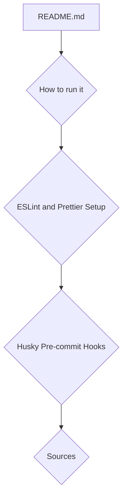

# Plan: Merge Documentation into README.md

This plan outlines the process for merging `HealthTracker/ESLINT_SETUP.md` and `HealthTracker/.kilocode/rules/HUSKY_SETUP.md` into the root `README.md`.

## 1. New README.md Structure

The `README.md` will be updated to include two new main sections:

- **ESLint and Prettier Setup**: This section will contain the content from `HealthTracker/ESLINT_SETUP.md`.
- **Husky Pre-commit Hooks**: This section will contain the content from `HealthTracker/.kilocode/rules/HUSKY_SETUP.md`.

The new sections will be added after the "How to run it" section and before the "Sources" section.

## 2. Content Integration

### ESLint Section

- The content of `HealthTracker/ESLINT_SETUP.md` will be copied into the new "ESLint and Prettier Setup" section.
- All information, including installed dependencies, configuration files, and available scripts, will be preserved.

### Husky Section

- The content of `HealthTracker/.kilocode/rules/HUSKY_SETUP.md` will be copied into the new "Husky Pre-commit Hooks" section.
- We will ensure that all explanations, from the overview to the troubleshooting guide, are included.

## 3. Link Adjustments

The relative links in the markdown files will be updated to reflect their new location in the root `README.md`.

### Husky Link Changes

- `../package.json` will be changed to `HealthTracker/package.json`
- `../.husky/pre-commit` will be changed to `HealthTracker/.husky/pre-commit`
- `./pre-commit-lint.sh` will be changed to `HealthTracker/.kilocode/rules/pre-commit-lint.sh`
- `../eslint.config.js` will be changed to `HealthTracker/eslint.config.js`

### ESLint Link Changes

No link changes are required for the ESLint content, as it does not contain relative links.

## 4. Cleanup

After the merge is complete and verified, the following files will be deleted to avoid redundancy:

- `HealthTracker/ESLINT_SETUP.md`
- `HealthTracker/.kilocode/rules/HUSKY_SETUP.md`

This will centralize the documentation and make it easier for developers to find the information they need.